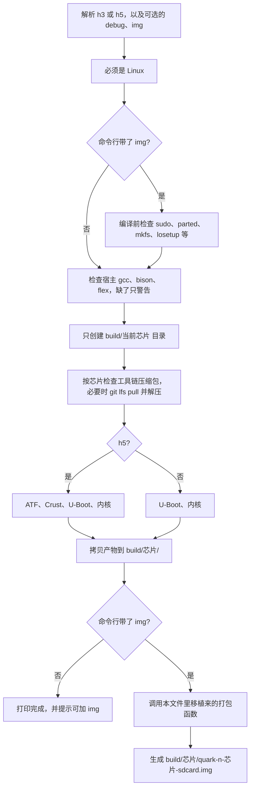

# buidl_tools.py 迁移方案

日期：2026-10-01  
状态：已按补充意见写入 `build-scripts/buidl_tools.py`，并更新了 `build-scripts/README.md`。

不改 `build-scripts/buidl_tools.sh`，也不改 `build-scripts/makeimg.py`。

本文在 Windows 上只做阅读和写文档。脚本要在 Linux 编译机上跑。我无法在这边替你执行编译或打包。

## 1. 已确认的决定

1. 新入口是 `build-scripts/buidl_tools.py`。带 `img` 时不执行 `python3 build-scripts/makeimg.py`，把 `makeimg.py` 里的打包函数复制进这个新文件，在同一次 Python 进程里调用。
2. 命令行不增加 `--rootfs`、`--size`、`--skip-modules`。打包使用 `makeimg.py` 现在的默认值：按芯片在 `tools/` 里找 rootfs，镜像大小自动计算，符合条件时安装内核模块。
3. `buidl_tools.sh` 保留，继续可以 `. build-scripts/buidl_tools.sh h5 debug`。
4. 交叉编译器路径只放进这次 Python 进程。它拉起的 `make`、`tar`、`git` 会继承。脚本退出后，当前 bash 的 `PATH` 保持原样。

`makeimg.py` 仍然可以单独用来给已经编译好的产物打包。新脚本不调用它。打包逻辑因此有两份。以后如果改分区、boot.cmd 或 rootfs 查找顺序，需要同时改 `makeimg.py` 和 `buidl_tools.py`，除非以后再合并。

## 2. 用法

在 Linux 上，仓库任意目录都可以执行。脚本用自己的文件位置计算仓库根，不依赖当前目录，也不使用 `source`。

不带参数，或带 `--help`、`-h`，只打印命令清单，退出码 0，不开始编译。清单里 H3 和 H5 都会出现，每条都可以直接复制：

```bash
python3 build-scripts/buidl_tools.py
python3 build-scripts/buidl_tools.py --help
```

H5：

```bash
python3 build-scripts/buidl_tools.py h5
python3 build-scripts/buidl_tools.py h5 debug
python3 build-scripts/buidl_tools.py h5 img
python3 build-scripts/buidl_tools.py h5 debug img
```

H3：

```bash
python3 build-scripts/buidl_tools.py h3
python3 build-scripts/buidl_tools.py h3 debug
python3 build-scripts/buidl_tools.py h3 img
python3 build-scripts/buidl_tools.py h3 debug img
```

单独打包、不重新编译：

```bash
python3 build-scripts/makeimg.py h5
python3 build-scripts/makeimg.py h3
```

`debug` 和 `img` 可以都不写、只写一个，或者两个都写。两个都写时顺序不限，例如 `h3 img debug`。

`time` 仍是 shell 的计时，统计整次 Python 进程。带 `img` 时，这段时间包含编译和打包。

不带 `img` 时只编译。编译成功后固定再打印一段提示：说明这次没有打包，并再次给出 H3、H5 的「编译并打包」命令，以及单独执行 `makeimg.py` 的命令。

非法情况打印同一份命令清单后退出，退出码 1：

- 芯片名不是 `h3` / `h5`
- 出现 `debug`、`img` 以外的词，包括 `--rootfs`、`--size`
- `debug` 或 `img` 重复

大小写敏感。`Debug`、`IMG` 算非法参数。这和 shell 里判断 `== "debug"` 一致。

## 3. 总流程



编译中途失败则不会进入打包。已经生成的 `build/<soc>/` 产物留在磁盘上，和现在编译失败后的情况一样。

编译成功、打包失败时，退出码是 1。编译产物保留，不完整的 `*.img.partial` 按 `makeimg.py` 现有逻辑删除。

## 4. 参数和行为对照

| 命令 | 行为 |
|---|---|
| `buidl_tools.py h5` | 与 `. build-scripts/buidl_tools.sh h5` 的编译结果相同，不生成 sdcard.img |
| `buidl_tools.py h5 debug` | 与带 `debug` 的 shell 相同：相关 `make` 增加 `V=1` |
| `buidl_tools.py h5 img` | 先完成与不带 debug 相同的编译，再按 `makeimg.py h5` 的默认参数打包 |
| `buidl_tools.py h5 debug img` | 编译时 `V=1`，成功后再打包 |

`debug` 只表示 `V=1`。它不会把 ATF 编成 debug 版，产物路径仍是：

`arm-trusted-firmware/build/sun50i_a64/release/bl31.bin`

依据是 `buidl_tools.sh` 第 275 行和第 466–470 行：`debug` 只导出 `MAKE_VERBOSE=1`，ATF 的 `make` 没有 `DEBUG=1`。

不带 `debug` 时，即使当前环境里已经有 `MAKE_VERBOSE`，也不会给 `make` 加 `V=1`。依据是 shell 在参数不是 `debug` 时执行 `unset MAKE_VERBOSE`（第 469 行）。Python 不再 `source`，所以不会去清你交互式 shell 里的这个变量，只是本次 `make` 不加 `V=1`。

哪些 `make` 会带 `V=1`，与 shell 相同：

| 步骤 | 带 debug 时 |
|---|---|
| ATF 的 `make bl31` | 加 `V=1` |
| Crust 的 `make <defconfig>` | 不加 |
| Crust 的正式 `make` | 加 `V=1` |
| U-Boot 的 defconfig | 不加 |
| U-Boot 的正式 `make` | 加 `V=1` |
| 内核 defconfig、olddefconfig | 不加 |
| 内核正式 `make` | 加 `V=1` |

ATF 和 Crust 不加 `-j`。U-Boot 和内核加 `-j`。并行数来自环境变量 `JOBS`；没有设置时用 CPU 核数，取不到核数时用 4。`JOBS` 的字符串原样传给 `make`，和 shell 的 `detect_jobs` 相同。

## 5. 编译步骤（从 buidl_tools.sh 移植）

仓库根按脚本位置计算，与 shell 第 9–11 行一致：

- `REPO_ROOT`：`build-scripts/` 的上一级
- `TOOLS_DIR`：`REPO_ROOT/tools`
- `BUILD_ROOT`：`REPO_ROOT/build`

Python 用 `subprocess` 的 `cwd` 指定 `make` 的目录，进程自己不 `chdir`。因此不需要 shell 在 `source` 结束后 `cd` 回原目录的那段逻辑（第 500–510 行）。

每条外部命令执行前打印一行，以 `+` 开头，后面是完整命令。shell 原来只打印 `========` 横幅。这是输出上的差别，编译参数本身不变。

### 5.1 工具链和 Git LFS

按芯片检查这些压缩包。文件不存在、小于 100000 字节，或第一行是 `version https://git-lfs.github.com/spec/v1` 时，视为需要 `git lfs pull`。

| 芯片 | 压缩包 |
|---|---|
| h5 | `tools/arm-gnu-toolchain-15.2.rel1-x86_64-aarch64-none-linux-gnu.tar.xz` |
| h5 | `tools/or1k-linux-musl-7.2.0-20180317.tar.gz` |
| h3 | `tools/arm-gnu-toolchain-15.2.rel1-x86_64-arm-none-linux-gnueabihf.tar.xz` |

环境变量 `LOIS_SKIP_GIT_LFS` 非空时，发现指针或过小文件就失败，不自动拉取。空字符串视为没设置。与 shell 第 147–149 行的 `-n` 判断一致。

自动拉取时依次尝试 `apt-get`、`dnf`、`yum`、`pacman` 安装 `git-lfs`，然后在仓库根执行 `git lfs install` 和 `git lfs pull`。`git lfs install` 会改这个仓库的 Git 配置，这是 shell 里已有的行为。

解压目录：

| 工具链 | 目录 | 判断已就绪的编译器 |
|---|---|---|
| H3 ARM32 | `tools/15.2.rel1-arm` | `bin/arm-none-linux-gnueabihf-gcc` |
| H5 AArch64 | `tools/15.2.rel1-arm64` | `bin/aarch64-none-linux-gnu-gcc` |
| Crust or1k | `tools/or1k-linux-musl-7.2.0` | `bin/or1k-linux-musl-gcc` |

本地编译器已存在就把对应 `bin` 插到本次进程 `PATH` 最前面。本地没有、但 `PATH` 里已经能找到同名编译器时，不再解压。两边都没有才解压，解压后再把 `bin` 插入 `PATH`。

or1k 先用 `tar -xzf --strip-components=1`。失败则清空解压目录后不带 `--strip-components` 再解一次，并在最多 4 层目录内查找 `or1k-linux-musl-gcc`。清空时会删除该目录下的全部条目，包括点开头的名字。shell 的 `rm -rf 目录/*` 不会删除点开头的文件。这里改成全部清空，避免第一次失败的残留混进第二次解压。

未移植 shell 第 64–71 行的 `_lois_git_toplevel_for_lfs`。全文件只有定义、没有调用。

宿主 `gcc`、`bison`、`flex` 缺失时只打印警告，不中断。建议命令仍是 `sudo apt install -y build-essential bison flex`。

### 5.2 H5

顺序与 shell 第 479–486 行一致。

1. AArch64 工具链、or1k 工具链。
2. ATF：在 `arm-trusted-firmware` 执行  
   `make CROSS_COMPILE=aarch64-none-linux-gnu- PLAT=sun50i_a64 bl31`  
   要求生成 `build/sun50i_a64/release/bl31.bin`。
3. Crust：默认 defconfig 是 `orangepi_zero_plus_defconfig`，可用环境变量 `CRUST_DEFCONFIG` 覆盖。  
   编译前把 `crust/arch/or1k/Makefile` 里包含 `-msfimm -mshftimm -msoft-div -msoft-mul` 且尚未以 `#` 开头的行，行首加上 `# `。备份文件名为原文件名加 `.lois_bak`。成功或失败都会把备份移回去。  
   然后 `make <defconfig>`，再 `make CROSS_COMPILE=or1k-linux-musl- HOST_COMPILE=`。  
   要求生成 `crust/build/scp/scp.bin`。
4. U-Boot：设置 `BL31`、`SCP` 后执行  
   `make quark-luoorshi-h5_defconfig ARCH=arm CROSS_COMPILE=aarch64-none-linux-gnu-`  
   再 `make ARCH=arm CROSS_COMPILE=aarch64-none-linux-gnu- -j<JOBS>`。  
   标准输出和标准错误写入 `build/h5/u-boot-build.log`，同时打到终端。  
   shell 第 318 行的 `make clean` 是注释，Python 也不执行 clean。  
   要求生成 `u-boot/u-boot-sunxi-with-spl.bin`。
5. 内核：  
   `make quark-luoorshi-h5_defconfig ARCH=arm64`  
   `make olddefconfig ARCH=arm64 CROSS_COMPILE=aarch64-none-linux-gnu-`  
   删除旧的 `linux/arch/arm64/boot/Image`，避免编译失败后残留文件被当成成功。  
   `make ARCH=arm64 CROSS_COMPILE=aarch64-none-linux-gnu- -j<JOBS> Image dtbs modules`  
   日志：`build/h5/kernel-build.log`。  
   要求存在 `arch/arm64/boot/Image` 和 `arch/arm64/boot/dts/allwinner/sun50i-h5-quark-luoorshi.dtb`。
6. 复制到 `build/h5/`：

| 源 | 目标文件名 |
|---|---|
| `u-boot/u-boot-sunxi-with-spl.bin` | `u-boot-sunxi-with-spl-h5.bin` |
| ATF `bl31.bin` | `bl31.bin` |
| `crust/build/scp/scp.bin` | `scp.bin` |
| `linux/arch/arm64/boot/Image` | `Image` |
| `sun50i-h5-quark-luoorshi.dtb` | `sun50i-h5-quark-luoorshi.dtb` |
| `linux/System.map` | `System.map`（没有就跳过） |
| `linux/.config` | `kernel.config`（没有就跳过） |

### 5.3 H3

没有 ATF，也没有 Crust。顺序与 shell 第 488–491 行一致。

1. ARM32 工具链。
2. U-Boot：`quark-luoorshi-h3_defconfig`，`CROSS_COMPILE=arm-none-linux-gnueabihf-`。不执行已注释的 `make clean`。日志 `build/h3/u-boot-build.log`。
3. 内核：`quark-luoorshi-h3_defconfig`、`olddefconfig`，然后  
   `make ARCH=arm CROSS_COMPILE=arm-none-linux-gnueabihf- -j<JOBS> Image zImage dtbs modules`。  
   编译前删除旧的 `arch/arm/boot/Image` 和 `zImage`。  
   日志 `build/h3/kernel-build.log`。  
   三个文件都必须存在：`Image`、`zImage`、`sun8i-h3-quark-luoorshi.dtb`。

`build-scripts/README.md` 第 69、77 行写了 U-Boot 会 `make clean`，H3 内核目标里也没有写 `zImage`。那些句子和当前 `buidl_tools.sh` 不一致。Python 以 shell 源码为准：不 clean，H3 同时编 `Image` 和 `zImage`。H3 的 U-Boot 用 `bootz` 启动 `zImage`，所以 `zImage` 必须编出来。

复制到 `build/h3/`：`u-boot-sunxi-with-spl-h3.bin`、`Image`、`zImage`、`sun8i-h3-quark-luoorshi.dtb`，以及可选的 `System.map`、`kernel.config`。

### 5.4 RTL8723BU 固件

内核编译之后、归档阶段：

- 若没有 `linux/drivers/net/wireless/realtek/rtl8xxxu/8723b.o`，打印跳过，编译仍算成功。
- 若有这个 `.o`，则必须存在  
  `linux/drivers/net/wireless/realtek/rtl8xxxu/firmware/rtl8723bu_nic.bin`  
  并复制到 `build/<soc>/lib/firmware/rtlwifi/rtl8723bu_nic.bin`。

当前 defconfig 会编这个文件，依据如下，不是推测：

- H5：`linux/arch/arm64/configs/quark-luoorshi-h5_defconfig` 第 448 行 `CONFIG_RTL8XXXU=m`
- H3：`linux/arch/arm/configs/quark-luoorshi-h3_defconfig` 第 60 行 `CONFIG_RTL8XXXU=y`

`=m` 和 `=y` 都会生成 `8723b.o`。按这两份 defconfig 编译时，固件会被复制。若以后关掉 `CONFIG_RTL8XXXU`，编译可以成功，但带 `img` 的打包会在装固件时失败。这是现有 `makeimg.py` 的 `install_staged_firmware` 已经如此，移植后保持不变。

## 6. 打包步骤（从 makeimg.py 移植）

只在命令行带 `img` 时执行。不启动 `makeimg.py` 这个文件。

入口固定为：

- rootfs 参数：空，走默认查找
- 镜像大小：空，自动计算
- 安装模块：不跳过

因此和下面这两条的打包结果同一套规则：

```bash
python3 build-scripts/makeimg.py h5
python3 build-scripts/makeimg.py h3
```

### 6.1 开始打包前就要有的命令

带 `img` 时，在编译开始前检查这些命令是否存在。缺了就立刻失败，避免编完才发现不能打包：

`sudo`、`parted`、`mkfs.vfat`、`mkfs.ext4`、`losetup`、`truncate`、`dd`、`tar`、`du`、`cp`、`mount`、`umount`、`mountpoint`、`sync`、`make`

只检查命令在不在 `PATH` 里。`sudo` 要密码时，仍会在真正打包时提示，和单独跑 `makeimg.py` 一样。

不带 `img` 时不检查这一组命令。只编译时不需要 `parted` 和 `losetup`。

打包日志写入 `build/<soc>/makeimg.log`，每次打包覆盖。不带 `img` 的编译不会打开或清空这个文件。

### 6.2 rootfs 默认查找顺序

H5 压缩包，找到即用：

1. `tools/rootfs-arm64.tar.gz`
2. `tools/arm64_rootfs.tar.gz`
3. `tools/arm64-rootfs.tar.gz`

都没有再看目录 `tools/arm64_rootfs`。

H3 压缩包：

1. `tools/rootfs-arm32.tar.gz`
2. `tools/arm32_rootfs.tar.gz`
3. `tools/arm32-rootfs.tar.gz`
4. `tools/rootfs-armhf.tar.gz`

都没有再看目录 `tools/arm32_rootfs`。

压缩包解压到 `build/<soc>/rootfs`。压缩包路径、大小、修改时间都没变，且已有像 rootfs 的目录时，直接复用。判断像 rootfs 的标准是目录里至少有 `bin`、`sbin`、`etc`、`usr`、`lib` 之一；若当前目录不像，且只有一个非点开头的子目录像，则用那个子目录。

rootfs 目录在 `/proc/mounts` 里仍有挂载（例如 chroot 留下的 `proc`）时，拒绝打包，避免把宿主机目录卷进镜像。

### 6.3 镜像大小

未传大小时，与 `makeimg.py` 的 `choose_image_mib` 相同：

```text
root_mib = rootfs 字节数向上取整到 MiB
modules_mib = 要安装模块时 256，否则 0
total = 256 + root_mib + modules_mib + 512
image_mib = max(2048, 向上对齐到 128 的 total)
```

数字来源：`BOOT_END_MIB = 256`，`MODULES_RESERVE_MIB = 256`，`ROOT_FREE_MIB = 512`，`MIN_IMAGE_MIB = 2048`。

另外要求 `build/` 所在磁盘剩余空间至少为 rootfs 字节数再加 512MiB。

### 6.4 分区和启动脚本

不写物理磁盘。先写 `build/<soc>/quark-n-<soc>-sdcard.img.partial`，全部成功后才替换为 `quark-n-<soc>-sdcard.img`。

分区表是 msdos：

- 1MiB 到 256MiB：FAT32，卷标 `BOOT`
- 256MiB 到末尾：ext4，卷标 `rootfs`
- U-Boot 用 `dd bs=1k seek=8 conv=notrunc` 写到循环设备，偏移 8KiB

`boot.cmd` / `boot.scr` 内容与 `makeimg.py` 的 `write_boot_script` 相同。H5 用 `booti` 加载 `Image`，H3 用 `bootz` 加载 `zImage`。

```text
setenv bootargs "console=ttyS0,115200 root=/dev/mmcblk0p2 rootwait panic=10"
setenv devtype mmc
setenv devnum 0
setenv distro_bootpart 1
mmc dev 0
load ${devtype} ${devnum}:${distro_bootpart} ${kernel_addr_r} <Image 或 zImage>
load ${devtype} ${devnum}:${distro_bootpart} ${fdt_addr_r} <dtb 文件名>
booti 或 bootz ${kernel_addr_r} - ${fdt_addr_r}
```

`mkimage` 优先用 `u-boot/tools/mkimage`。U-Boot 刚编过时这个文件应该在。否则用 `PATH` 里的 `mkimage`。

启动分区放入内核、dtb、`boot.scr`。根分区复制 rootfs，创建 `proc`、`sys`、`dev`、`run`、`tmp`，`tmp` 权限 `1777`，再放入 RTL8723BU 固件。需要安装模块时，对镜像里的根分区执行 `modules_install`。

模块安装的拒绝条件与 `makeimg.py` 相同：当前 `linux/.config` 的 ARM/ARM64 必须和本次芯片一致；要写入启动分区的内核必须和内核树里的内核内容一致。H3 与 H5 共用一棵 `linux/`，这个检查用来避免把另一颗芯片的 `.ko` 装进镜像。

H3 在打包前仍会走移植过来的 `build_h3_zimage`。内核树仍是 32 位配置时，它会再执行一次 `make zImage`。刚刚编过的话，这次 make 会很快结束。这是单独跑 `makeimg.py h3` 时已有的步骤。

清单写入 `build/<soc>/makeimg-manifest.txt`。

脚本最后打印烧录示例，不会自己 `dd` 到 TF 卡：

```bash
sudo dd if=build/<soc>/quark-n-<soc>-sdcard.img of=/dev/sdX bs=4M status=progress conv=fsync
```

### 6.5 相对 makeimg.py 改动的提示文字

打包函数的分区、默认 rootfs 查找、体积计算和模块判断保持原样。提示文字从「请先执行 buidl_tools.sh」改成「本次编译未生成……」，因为编译和打包已经在同一个脚本里。`makeimg.py` 自己的原文不改。

新命令行没有 `--rootfs` 和 `--size`，所以 `prepare_rootfs` 只走默认查找，`choose_image_mib` 只走自动放大。`resolve_user_path`、`is_archive`、`parse_size_mib` 仍写在源码里，当前入口不会调用。它们是 `makeimg.py` 里解析用户指定路径和大小的函数，留在文件里是为了以后若要加回这两个参数时不必重新移植。

## 7. 环境变量

| 变量 | 作用 |
|---|---|
| `JOBS` | 传给 U-Boot 和内核的 `make -j`。不设置则用核数，再不行用 4 |
| `LOIS_SKIP_GIT_LFS` | 非空则不自动 `git lfs pull` |
| `CRUST_DEFCONFIG` | 覆盖 Crust 的 defconfig，默认 `orangepi_zero_plus_defconfig` |
| `GCC_COLORS` | 脚本设为 `auto`，只影响本次进程里的 gcc |
| `BL31`、`SCP` | 编 H5 U-Boot 前写入本次进程，供 U-Boot 的 make 读取 |
| `MAKE_VERBOSE` | 只由命令行 `debug` 决定。有 `debug` 时设为 `1` 并给 make 加 `V=1` |

这些赋值都在 Python 进程内。退出后交互式 shell 看不到。

新脚本只用 Python 标准库，不需要 `pip`。shell 末尾关于 `pip3` 的那句提示不带到新脚本里。依据：`makeimg.py` 的 import 只有 `argparse`、`filecmp`、`os`、`shutil`、`subprocess`、`sys`、`time`、`pathlib`。

## 8. 日志和退出码

| 文件 | 何时写入 |
|---|---|
| `build/h5/u-boot-build.log` 或 `build/h3/u-boot-build.log` | 每次编 U-Boot 时覆盖 |
| `build/h5/kernel-build.log` 或 `build/h3/kernel-build.log` | 每次编内核时覆盖 |
| `build/<soc>/makeimg.log` | 只有带 `img` 且进入打包时覆盖 |
| `build/<soc>/makeimg-manifest.txt` | 打包成功后写入 |
| `build/<soc>/makeimg.loop` | 打包过程中记录循环设备，结束或失败清理时删除 |

成功退出码 0。参数错误、编译失败、打包失败都是退出码 1。

## 9. 关键字

以后在仓库里搜索可以用这些词：

- `buidl_tools.py`
- `MAKE_VERBOSE`
- `V=1`
- `LOIS_SKIP_GIT_LFS`
- `CRUST_DEFCONFIG`
- `JOBS`
- `quark-n-h5-sdcard.img`
- `quark-n-h3-sdcard.img`
- `rtl8723bu_nic.bin`
- `8723b.o`
- `CONFIG_RTL8XXXU`
- `.lois_bak`
- `sun50i_a64`
- `bootz`
- `booti`

## 10. 确认后你在 Linux 上建议执行的检查

我这边不能编译。文件落地后，请在 Linux 编译机上自行验证。建议顺序：

```bash
python3 build-scripts/buidl_tools.py
python3 build-scripts/buidl_tools.py --help
```

这两条应打印 H3 和 H5 的编译命令、编译并打包命令，以及 `makeimg.py` 的单独打包命令，退出码为 0，并且还没开始 `make`。输出里要能直接复制 `h3` 和 `h5` 两套命令。

```bash
python3 build-scripts/buidl_tools.py h5 foo
python3 build-scripts/buidl_tools.py h5 debug debug
```

这两条应打印同一份命令清单后失败，退出码 1，并且还没开始 `make`。

然后按你实际要编的芯片：

```bash
time python3 build-scripts/buidl_tools.py h5 debug
```

看 `build/h5/` 里是否有 `u-boot-sunxi-with-spl-h5.bin`、`bl31.bin`、`scp.bin`、`Image`、dtb、两份 log。这条不带 `img`，不应生成新的 sdcard 镜像，也不应改掉已有的 `makeimg.log`。结束时要打印「本次没有打包」，并同时给出 H5、H3 的 `buidl_tools.py ... img` 和 `makeimg.py` 命令。

确认编译正常后，再测带镜像的完整路径：

```bash
time python3 build-scripts/buidl_tools.py h5 debug img
```

成功时应有 `build/h5/quark-n-h5-sdcard.img` 和 `makeimg-manifest.txt`。脚本不应出现对 `makeimg.py` 的调用。可以用下面的命令在打包机上确认进程参数里没有第二个脚本名：

```bash
# 打包进行时另开一个终端
ps -ef | grep makeimg.py
```

没有匹配才符合这次的设计。H3 把上面的 `h5` 换成 `h3`。

旧命令应保持可用：

```bash
time . build-scripts/buidl_tools.sh h5 debug
```

## 11. 已落地的行为

`build-scripts/buidl_tools.py` 与第 12 节一致。若要改，直接指出编号：

1. 新文件名就是 `build-scripts/buidl_tools.py`。
2. 不修改 `buidl_tools.sh` 和 `makeimg.py`。
3. 参数只有芯片名、可选 `debug`、可选 `img`，顺序不限。
4. 带 `img` 时使用 `makeimg.py` 的默认 rootfs、自动大小，并在条件满足时安装模块。
5. 带 `img` 时，编译开始前就检查打包命令。
6. 外部命令打印 `+` 开头的一行。
7. 不移植从未被调用的 `_lois_git_toplevel_for_lfs`。
8. or1k 第二次解压前清空目录下全部文件，包括点开头的文件。
9. `debug` 只表示 `V=1`，不表示 ATF debug 构建。

## 12. 已写入的完整源码

下面这一整段就是 `build-scripts/buidl_tools.py`。不要把 markdown 的代码围栏写进 py 文件。

```python
#!/usr/bin/env python3
# -*- coding: utf-8 -*-
"""H3/H5 统一编译入口。命令行带 img 时，在同一次运行里打包 TF 卡镜像。

不带参数或 --help 会打印 H3 与 H5 的可复制命令。
不带 img 时只编译，结束后提示打包命令，以及单独执行 makeimg.py 的命令。
打包逻辑从 makeimg.py 移植到本文件，运行时不执行 makeimg.py。
rootfs 与镜像大小使用 makeimg.py 的默认规则。
工具链 PATH 只存在于本 Python 进程及其子进程。
"""

from __future__ import annotations

import filecmp
import os
import shutil
import subprocess
import sys
import time
from pathlib import Path


REPO_ROOT = Path(__file__).resolve().parent.parent
BUILD_ROOT = REPO_ROOT / "build"
TOOLS_DIR = REPO_ROOT / "tools"
LINUX_DIR = REPO_ROOT / "linux"

LFS_POINTER_PREFIX = "version https://git-lfs.github.com/spec/v1"
ARCHIVE_MIN_BYTES = 100000

BOOT_END_MIB = 256
MIN_IMAGE_MIB = 2048
MODULES_RESERVE_MIB = 256
ROOT_FREE_MIB = 512
EXPLICIT_SLACK_MIB = 64

STAGED_FW_REL = Path("lib/firmware/rtlwifi/rtl8723bu_nic.bin")
RTL_OBJ = LINUX_DIR / "drivers/net/wireless/realtek/rtl8xxxu/8723b.o"
RTL_FW_SRC = LINUX_DIR / "drivers/net/wireless/realtek/rtl8xxxu/firmware/rtl8723bu_nic.bin"

OR1K_DIR = TOOLS_DIR / "or1k-linux-musl-7.2.0"
OR1K_ARCHIVE = TOOLS_DIR / "or1k-linux-musl-7.2.0-20180317.tar.gz"
OR1K_GCC_NAME = "or1k-linux-musl-gcc"

SOC_INFO = {
    "h5": {
        "mkimage_arch": "arm64",
        "make_arch": "arm64",
        "cross": "aarch64-none-linux-gnu-",
        "toolchain_dir": "15.2.rel1-arm64",
        "toolchain_archive": "arm-gnu-toolchain-15.2.rel1-x86_64-aarch64-none-linux-gnu.tar.xz",
        "uboot_defconfig": "quark-luoorshi-h5_defconfig",
        "kernel_defconfig": "quark-luoorshi-h5_defconfig",
        "uboot_name": "u-boot-sunxi-with-spl-h5.bin",
        "dtb_name": "sun50i-h5-quark-luoorshi.dtb",
        "kernel_file": "Image",
        "boot_cmd": "booti",
        "linux_image": Path("arch/arm64/boot/Image"),
        "linux_dtb": Path("arch/arm64/boot/dts/allwinner/sun50i-h5-quark-luoorshi.dtb"),
        "kernel_targets": ["Image", "dtbs", "modules"],
        "archives": (
            "rootfs-arm64.tar.gz",
            "arm64_rootfs.tar.gz",
            "arm64-rootfs.tar.gz",
        ),
        "dirs": ("arm64_rootfs",),
    },
    "h3": {
        "mkimage_arch": "arm",
        "make_arch": "arm",
        "cross": "arm-none-linux-gnueabihf-",
        "toolchain_dir": "15.2.rel1-arm",
        "toolchain_archive": "arm-gnu-toolchain-15.2.rel1-x86_64-arm-none-linux-gnueabihf.tar.xz",
        "uboot_defconfig": "quark-luoorshi-h3_defconfig",
        "kernel_defconfig": "quark-luoorshi-h3_defconfig",
        "uboot_name": "u-boot-sunxi-with-spl-h3.bin",
        "dtb_name": "sun8i-h3-quark-luoorshi.dtb",
        "kernel_file": "zImage",
        "boot_cmd": "bootz",
        "linux_image": Path("arch/arm/boot/zImage"),
        "linux_dtb": Path("arch/arm/boot/dts/allwinner/sun8i-h3-quark-luoorshi.dtb"),
        "kernel_targets": ["Image", "zImage", "dtbs", "modules"],
        "archives": (
            "rootfs-arm32.tar.gz",
            "arm32_rootfs.tar.gz",
            "arm32-rootfs.tar.gz",
            "rootfs-armhf.tar.gz",
        ),
        "dirs": ("arm32_rootfs",),
    },
}

USAGE = """\
H3 与 H5 都可以编译。不带参数、--help 或 -h 只打印下面这些命令，不开始编译。

H5 只编译:
  python3 build-scripts/buidl_tools.py h5
  python3 build-scripts/buidl_tools.py h5 debug

H5 编译并打包:
  python3 build-scripts/buidl_tools.py h5 img
  python3 build-scripts/buidl_tools.py h5 debug img

H3 只编译:
  python3 build-scripts/buidl_tools.py h3
  python3 build-scripts/buidl_tools.py h3 debug

H3 编译并打包:
  python3 build-scripts/buidl_tools.py h3 img
  python3 build-scripts/buidl_tools.py h3 debug img

单独打包，不重新编译:
  python3 build-scripts/makeimg.py h5
  python3 build-scripts/makeimg.py h3

说明:
  debug  可省略。写上则相关 make 增加 V=1。可以写在 img 前面或后面。
  img    可省略。写上则编译成功后在本脚本内打包。不写则只编译，结束时会再提示打包命令。
  debug 与 img 不能重复，也不能写其它参数。
"""

_LOG_FH = None


def log(msg: str) -> None:
    print(msg, flush=True)
    if _LOG_FH is not None:
        _LOG_FH.write(msg + "\n")
        _LOG_FH.flush()


def die(msg: str) -> None:
    text = "错误: " + msg
    print(text, file=sys.stderr, flush=True)
    if _LOG_FH is not None:
        _LOG_FH.write(text + "\n")
        _LOG_FH.flush()
    sys.exit(1)


def _quote(text: str) -> str:
    if text == "" or any(ch.isspace() for ch in text):
        return "'" + text.replace("'", "'\"'\"'") + "'"
    return text


def run(cmd: list[str], cwd: Path | None = None, fail: str | None = None) -> None:
    shown = " ".join(_quote(str(part)) for part in cmd)
    log("+ " + shown)
    result = subprocess.run(cmd, cwd=None if cwd is None else str(cwd))
    if result.returncode != 0:
        die(fail or f"命令失败（退出码 {result.returncode}）: {shown}")


def run_quiet(cmd: list[str]) -> int:
    result = subprocess.run(cmd, stdout=subprocess.DEVNULL, stderr=subprocess.DEVNULL)
    return result.returncode


def run_tee(cmd: list[str], log_path: Path, cwd: Path) -> int:
    """把子进程的标准输出和标准错误同时写到终端和日志。返回子进程退出码。"""
    shown = " ".join(_quote(str(part)) for part in cmd)
    log("+ " + shown)
    log_path.parent.mkdir(parents=True, exist_ok=True)
    try:
        handle = log_path.open("wb")
    except OSError as exc:
        die(f"无法写入日志 {log_path}: {exc}")
    with handle:
        proc = subprocess.Popen(
            cmd,
            cwd=str(cwd),
            stdout=subprocess.PIPE,
            stderr=subprocess.STDOUT,
        )
        assert proc.stdout is not None
        while True:
            chunk = proc.stdout.read(4096)
            if not chunk:
                break
            sys.stdout.buffer.write(chunk)
            sys.stdout.buffer.flush()
            handle.write(chunk)
        return proc.wait()


def ensure_linux() -> None:
    if not sys.platform.startswith("linux"):
        die("本脚本必须在 Linux 上运行。请在编译机上执行，不要在 Windows 上执行。")


def require_commands(names: list[str]) -> None:
    missing = [name for name in names if shutil.which(name) is None]
    if missing:
        die(
            "缺少命令: "
            + ", ".join(missing)
            + "。可安装: sudo apt install -y parted dosfstools e2fsprogs util-linux kmod coreutils tar"
        )


def open_log(soc: str) -> None:
    global _LOG_FH
    out_dir = BUILD_ROOT / soc
    out_dir.mkdir(parents=True, exist_ok=True)
    _LOG_FH = open(out_dir / "makeimg.log", "w", encoding="utf-8")


def parse_cli(argv: list[str]) -> tuple[str, bool, bool]:
    if not argv or argv[0] in ("-h", "--help"):
        print(USAGE, end="")
        sys.exit(0)
    soc = argv[0]
    if soc not in ("h3", "h5"):
        print(USAGE, end="", file=sys.stderr)
        die(f"缺少或无效参数: 需要 h3 或 h5，收到 {soc}")
    flags = argv[1:]
    unknown = [item for item in flags if item not in ("debug", "img")]
    if unknown:
        print(USAGE, end="", file=sys.stderr)
        die("不能识别的参数: " + " ".join(unknown))
    if len(flags) != len(set(flags)):
        die("debug 和 img 不能重复")
    return soc, "debug" in flags, "img" in flags


def warn_missing_host_tools() -> None:
    missing = [name for name in ("gcc", "bison", "flex") if shutil.which(name) is None]
    if missing:
        log("=========================================")
        log("警告：系统可能缺少编译工具: " + " ".join(missing))
        log("建议: sudo apt install -y build-essential bison flex")
        log("=========================================")


def detect_jobs() -> str:
    jobs = os.environ.get("JOBS")
    if jobs:
        return jobs
    count = os.cpu_count()
    return str(count if count else 4)


def make_verbose_args() -> list[str]:
    if os.environ.get("MAKE_VERBOSE"):
        return ["V=1"]
    return []


def prepend_path(bindir: Path) -> None:
    text = str(bindir)
    parts = os.environ.get("PATH", "").split(os.pathsep)
    if text not in parts:
        os.environ["PATH"] = text + os.pathsep + os.environ.get("PATH", "")


def first_line(path: Path) -> str:
    with path.open("rb") as handle:
        raw = handle.readline(512)
    return raw.decode("utf-8", errors="replace").rstrip("\r\n")


def archive_needs_git_lfs_pull(archive: Path, min_bytes: int = ARCHIVE_MIN_BYTES) -> bool:
    if not archive.is_file():
        return True
    if first_line(archive) == LFS_POINTER_PREFIX:
        return True
    return archive.stat().st_size < min_bytes


def require_real_toolchain_archive(archive: Path, desc: str, min_bytes: int = ARCHIVE_MIN_BYTES) -> None:
    if not archive.is_file():
        die(f"未找到 {desc}: {archive}")
    size = archive.stat().st_size
    line = first_line(archive)
    if size < min_bytes:
        if line == LFS_POINTER_PREFIX:
            die(
                f"{desc} 仍为 Git LFS 指针（{size} 字节）。请在仓库根执行: git lfs pull\n"
                f"或按 tools/README.md 将完整压缩包放到: {archive}"
            )
        die(f"{desc} 文件过小（{size} 字节），可能损坏或未完整下载: {archive}")


def git_lfs_available() -> bool:
    return shutil.which("git") is not None and run_quiet(["git", "lfs", "version"]) == 0


def ensure_git_lfs_cli() -> None:
    if git_lfs_available():
        return
    log("未检测到 Git LFS 客户端，尝试安装 git-lfs ...")
    if shutil.which("apt-get"):
        run(["sudo", "apt-get", "update", "-qq"], fail="通过 apt 安装 git-lfs 失败，请手动执行: sudo apt install -y git-lfs")
        run(["sudo", "apt-get", "install", "-y", "git-lfs"], fail="通过 apt 安装 git-lfs 失败，请手动执行: sudo apt install -y git-lfs")
    elif shutil.which("dnf"):
        run(["sudo", "dnf", "install", "-y", "git-lfs"], fail="通过 dnf 安装 git-lfs 失败，请手动: sudo dnf install -y git-lfs")
    elif shutil.which("yum"):
        run(["sudo", "yum", "install", "-y", "git-lfs"], fail="通过 yum 安装 git-lfs 失败，请手动: sudo yum install -y git-lfs")
    elif shutil.which("pacman"):
        run(["sudo", "pacman", "-S", "--noconfirm", "git-lfs"], fail="通过 pacman 安装 git-lfs 失败，请手动: sudo pacman -S git-lfs")
    else:
        die("未找到 git-lfs，且无法自动安装（无 apt-get/dnf/yum/pacman）。请自行安装 git-lfs 后重试。")
    if not git_lfs_available():
        die("安装后 git lfs 仍不可用，请检查 PATH 与安装日志")
    result = subprocess.run(["git", "lfs", "version"], capture_output=True, text=True)
    first = ""
    for line in (result.stdout or "").splitlines():
        if line.strip():
            first = line.strip()
            break
    log("git-lfs 已可用: " + (first or "git lfs"))


def ensure_tools_git_lfs_archives(soc: str) -> None:
    names = [SOC_INFO[soc]["toolchain_archive"]]
    if soc == "h5":
        names.append(OR1K_ARCHIVE.name)
    archives = [TOOLS_DIR / name for name in names]
    if not any(archive_needs_git_lfs_pull(path) for path in archives):
        return
    if os.environ.get("LOIS_SKIP_GIT_LFS"):
        die("tools 工具链包未就绪（LFS 指针或过小），但已设置 LOIS_SKIP_GIT_LFS，跳过自动拉取。请自行放入完整压缩包或取消该变量。")
    log("======== 检测到 tools 工具链包为 Git LFS 指针或未完整，将安装/使用 git-lfs 并拉取 ========")
    if run_quiet(["git", "-C", str(REPO_ROOT), "rev-parse", "--is-inside-work-tree"]) != 0:
        die(f"无法自动拉取：{REPO_ROOT} 不是 git 工作区。请将真实压缩包放入 tools/，或使用含 LFS 的 git clone。")
    ensure_git_lfs_cli()
    run(["git", "lfs", "install"], cwd=REPO_ROOT, fail="git lfs pull 失败。请检查网络、LFS 远端与凭证。")
    run(["git", "lfs", "pull"], cwd=REPO_ROOT, fail="git lfs pull 失败。请检查网络、LFS 远端与凭证。")
    for path in archives:
        if archive_needs_git_lfs_pull(path):
            die(f"git lfs pull 后仍异常（仍为指针或过小）: {path}")
    log("======== tools 大文件已通过 Git LFS 就绪 ========")


def ensure_archived_toolchain(soc: str) -> None:
    info = SOC_INFO[soc]
    dest = TOOLS_DIR / info["toolchain_dir"]
    gcc_name = info["cross"] + "gcc"
    gcc_local = dest / "bin" / gcc_name
    archive = TOOLS_DIR / info["toolchain_archive"]
    desc = "AArch64 工具链压缩包" if soc == "h5" else "ARM32 工具链压缩包"
    if gcc_local.is_file() and os.access(gcc_local, os.X_OK):
        prepend_path(dest / "bin")
        return
    if shutil.which(gcc_name):
        return
    require_real_toolchain_archive(archive, desc)
    log(f"正在解压 {desc} 到 {dest} ...")
    dest.mkdir(parents=True, exist_ok=True)
    run(
        ["tar", "-xJf", str(archive), "-C", str(dest), "--strip-components=1"],
        fail=f"{desc} 解压失败（请确认 tar 支持 -J/xz，且压缩包完整）",
    )
    if not (gcc_local.is_file() and os.access(gcc_local, os.X_OK)):
        die(f"解压后未找到: {gcc_local}")
    prepend_path(dest / "bin")


def find_or1k_gcc(root: Path) -> Path | None:
    """等价于 find root -maxdepth 4 -type f -name or1k-linux-musl-gcc，取第一个可执行文件。"""
    for dirpath, dirnames, filenames in os.walk(root):
        rel = Path(dirpath).relative_to(root)
        depth = 0 if str(rel) == "." else len(rel.parts)
        if depth >= 4:
            dirnames[:] = []
            continue
        if OR1K_GCC_NAME not in filenames:
            continue
        candidate = Path(dirpath) / OR1K_GCC_NAME
        if candidate.is_file() and os.access(candidate, os.X_OK):
            return candidate
    return None


def clear_children(path: Path) -> None:
    for child in path.iterdir():
        if child.is_dir() and not child.is_symlink():
            shutil.rmtree(child)
        else:
            child.unlink()


def ensure_or1k_toolchain() -> None:
    gcc_local = OR1K_DIR / "bin" / OR1K_GCC_NAME
    if gcc_local.is_file() and os.access(gcc_local, os.X_OK):
        prepend_path(OR1K_DIR / "bin")
        return
    if shutil.which(OR1K_GCC_NAME):
        return
    require_real_toolchain_archive(OR1K_ARCHIVE, "or1k 工具链压缩包")
    log(f"正在解压 or1k 工具链到 {OR1K_DIR} ...")
    OR1K_DIR.mkdir(parents=True, exist_ok=True)
    shown = " ".join(
        [
            "tar",
            "-xzf",
            str(OR1K_ARCHIVE),
            "-C",
            str(OR1K_DIR),
            "--strip-components=1",
        ]
    )
    log("+ " + shown)
    stripped = subprocess.run(
        ["tar", "-xzf", str(OR1K_ARCHIVE), "-C", str(OR1K_DIR), "--strip-components=1"],
        stdout=subprocess.DEVNULL,
        stderr=subprocess.DEVNULL,
    )
    if stripped.returncode != 0:
        clear_children(OR1K_DIR)
        run(["tar", "-xzf", str(OR1K_ARCHIVE), "-C", str(OR1K_DIR)], fail="or1k 工具链解压失败")
        if not (gcc_local.is_file() and os.access(gcc_local, os.X_OK)):
            found = find_or1k_gcc(OR1K_DIR)
            if found is None:
                die("解压后未找到 or1k-linux-musl-gcc")
            prepend_path(found.parent)
            return
    if not (gcc_local.is_file() and os.access(gcc_local, os.X_OK)):
        die(f"解压后未找到: {gcc_local}")
    prepend_path(OR1K_DIR / "bin")


def comment_or1k_incompatible_cflags(path: Path) -> None:
    """把与老旧 or1k-linux-musl 不兼容的 CFLAGS 续行临时注释掉。已注释的行保持原样。"""
    needle = "-msfimm -mshftimm -msoft-div -msoft-mul"
    raw = path.read_bytes()
    newline = b"\r\n" if b"\r\n" in raw else b"\n"
    text = raw.decode("utf-8")
    lines = text.splitlines()
    changed = []
    for line in lines:
        if needle in line and not line.lstrip().startswith("#"):
            changed.append("# " + line)
        else:
            changed.append(line)
    payload = newline.decode("ascii").join(changed)
    if text.endswith("\n") or text.endswith("\r\n"):
        payload += newline.decode("ascii")
    path.write_bytes(payload.encode("utf-8"))


def build_atf() -> None:
    log("======== 编译 ATF (bl31) ========")
    prepend_path(TOOLS_DIR / SOC_INFO["h5"]["toolchain_dir"] / "bin")
    if shutil.which("aarch64-none-linux-gnu-gcc") is None:
        die("ATF 需要 aarch64-none-linux-gnu-gcc 在 PATH 中")
    run(
        ["make", *make_verbose_args(), "CROSS_COMPILE=aarch64-none-linux-gnu-", "PLAT=sun50i_a64", "bl31"],
        cwd=REPO_ROOT / "arm-trusted-firmware",
        fail="ATF 编译失败",
    )
    out = REPO_ROOT / "arm-trusted-firmware/build/sun50i_a64/release/bl31.bin"
    if not out.is_file():
        die(f"未生成 bl31.bin: {out}")


def build_crust() -> None:
    defconfig = os.environ.get("CRUST_DEFCONFIG") or "orangepi_zero_plus_defconfig"
    or1k_mk = REPO_ROOT / "crust/arch/or1k/Makefile"
    bak = Path(str(or1k_mk) + ".lois_bak")
    log(f"======== 编译 Crust (scp) defconfig={defconfig} ========")
    if not or1k_mk.is_file():
        die(f"未找到 {or1k_mk}")
    if shutil.which(OR1K_GCC_NAME) is None:
        die("Crust 需要 or1k-linux-musl-gcc 在 PATH 中")
    shutil.copy2(or1k_mk, bak)
    try:
        comment_or1k_incompatible_cflags(or1k_mk)
        crust = REPO_ROOT / "crust"
        run(["make", defconfig], cwd=crust, fail="Crust 编译失败")
        run(
            ["make", *make_verbose_args(), "CROSS_COMPILE=or1k-linux-musl-", "HOST_COMPILE="],
            cwd=crust,
            fail="Crust 编译失败",
        )
        if not (crust / "build/scp/scp.bin").is_file():
            die("Crust 编译失败")
    finally:
        if bak.is_file():
            os.replace(bak, or1k_mk)
    if not (REPO_ROOT / "crust/build/scp/scp.bin").is_file():
        die("未生成 scp.bin")


def build_uboot(soc: str) -> None:
    info = SOC_INFO[soc]
    jobs = detect_jobs()
    log(f"======== 编译 U-Boot ({soc.upper()}) ========")
    gcc_name = info["cross"] + "gcc"
    if shutil.which(gcc_name) is None:
        die(f"U-Boot {soc.upper()} 需要 {gcc_name}")
    if soc == "h5":
        bl31 = REPO_ROOT / "arm-trusted-firmware/build/sun50i_a64/release/bl31.bin"
        scp = REPO_ROOT / "crust/build/scp/scp.bin"
        if not bl31.is_file():
            die(f"缺少 BL31: {bl31}")
        if not scp.is_file():
            die(f"缺少 SCP: {scp}")
        os.environ["BL31"] = str(bl31)
        os.environ["SCP"] = str(scp)
    uboot = REPO_ROOT / "u-boot"
    run(
        ["make", info["uboot_defconfig"], "ARCH=arm", "CROSS_COMPILE=" + info["cross"]],
        cwd=uboot,
        fail="u-boot defconfig 失败",
    )
    code = run_tee(
        ["make", "ARCH=arm", "CROSS_COMPILE=" + info["cross"], *make_verbose_args(), "-j" + jobs],
        BUILD_ROOT / soc / "u-boot-build.log",
        uboot,
    )
    if code != 0:
        die(f"u-boot 编译失败 (exit {code})")
    if not (uboot / "u-boot-sunxi-with-spl.bin").is_file():
        die("未生成 u-boot-sunxi-with-spl.bin")


def build_kernel(soc: str) -> None:
    info = SOC_INFO[soc]
    jobs = detect_jobs()
    image = LINUX_DIR / "arch/arm64/boot/Image" if soc == "h5" else LINUX_DIR / "arch/arm/boot/Image"
    zimage = LINUX_DIR / "arch/arm/boot/zImage"
    dtb = LINUX_DIR / info["linux_dtb"]
    gcc_name = info["cross"] + "gcc"
    log(f"======== 编译 Linux 内核 ({soc.upper()}) ========")
    if shutil.which(gcc_name) is None:
        die(f"内核 {soc.upper()} 需要 {gcc_name}")
    run(
        ["make", info["kernel_defconfig"], "ARCH=" + info["make_arch"]],
        cwd=LINUX_DIR,
        fail="kernel defconfig 失败",
    )
    run(
        ["make", "olddefconfig", "ARCH=" + info["make_arch"], "CROSS_COMPILE=" + info["cross"]],
        cwd=LINUX_DIR,
        fail="kernel olddefconfig 失败",
    )
    if image.is_file():
        image.unlink()
    if soc == "h3" and zimage.is_file():
        zimage.unlink()
    code = run_tee(
        [
            "make",
            "ARCH=" + info["make_arch"],
            "CROSS_COMPILE=" + info["cross"],
            *make_verbose_args(),
            "-j" + jobs,
            *info["kernel_targets"],
        ],
        BUILD_ROOT / soc / "kernel-build.log",
        LINUX_DIR,
    )
    if code != 0:
        die(f"内核编译失败 (exit {code})，详见 {BUILD_ROOT / soc / 'kernel-build.log'}")
    if not image.is_file():
        die("未生成 " + str(image.relative_to(LINUX_DIR)))
    if soc == "h3" and not zimage.is_file():
        die("未生成 arch/arm/boot/zImage")
    if not dtb.is_file():
        die(f"未生成 DTB: {dtb}")


def copy_file(src: Path, dest: Path, desc: str) -> None:
    try:
        shutil.copy2(src, dest)
    except OSError as exc:
        die(f"{desc}: {dest} ({exc})")


def copy_rtl8723bu_firmware(soc: str) -> None:
    dest = BUILD_ROOT / soc / STAGED_FW_REL
    if not RTL_OBJ.is_file():
        log(f"未编译 8723b.c（没有 {RTL_OBJ}），跳过 RTL8723BU 固件")
        return
    if not RTL_FW_SRC.is_file():
        die(f"已编译 8723b.c，但缺少固件: {RTL_FW_SRC}")
    dest.parent.mkdir(parents=True, exist_ok=True)
    copy_file(RTL_FW_SRC, dest, "复制 RTL8723BU 固件失败")
    log(f"RTL8723BU 固件已复制到 {dest}")


def copy_optional(src: Path, dest: Path) -> None:
    if src.is_file():
        shutil.copy2(src, dest)


def copy_artifacts(soc: str) -> None:
    info = SOC_INFO[soc]
    out = BUILD_ROOT / soc
    out.mkdir(parents=True, exist_ok=True)
    copy_file(
        REPO_ROOT / "u-boot/u-boot-sunxi-with-spl.bin",
        out / info["uboot_name"],
        "复制 u-boot 失败",
    )
    if soc == "h5":
        bl31 = REPO_ROOT / "arm-trusted-firmware/build/sun50i_a64/release/bl31.bin"
        scp = REPO_ROOT / "crust/build/scp/scp.bin"
        if not bl31.is_file():
            die(f"缺少 bl31.bin，无法归档: {bl31}")
        if not scp.is_file():
            die(f"缺少 scp.bin，无法归档: {scp}")
        copy_file(bl31, out / "bl31.bin", "复制 bl31.bin 失败")
        copy_file(scp, out / "scp.bin", "复制 scp.bin 失败")
        image = LINUX_DIR / "arch/arm64/boot/Image"
        if not image.is_file():
            die(f"缺少内核 Image，无法归档: {image}")
        copy_file(image, out / "Image", "复制 Image 失败")
    else:
        image = LINUX_DIR / "arch/arm/boot/Image"
        zimage = LINUX_DIR / "arch/arm/boot/zImage"
        if not image.is_file():
            die(f"缺少内核 Image，无法归档: {image}")
        if not zimage.is_file():
            die(f"缺少内核 zImage，无法归档: {zimage}")
        copy_file(image, out / "Image", "复制 Image 失败")
        copy_file(zimage, out / "zImage", "复制 zImage 失败")
    dtb = LINUX_DIR / info["linux_dtb"]
    if not dtb.is_file():
        die(f"缺少 DTB，无法归档: {dtb}")
    copy_file(dtb, out / info["dtb_name"], "复制 dtb 失败")
    copy_optional(LINUX_DIR / "System.map", out / "System.map")
    copy_optional(LINUX_DIR / ".config", out / "kernel.config")
    copy_rtl8723bu_firmware(soc)
    if soc == "h5":
        log(f"产物已复制到 {out}/ （含 u-boot、bl31、scp、Image、dtb）")
    else:
        log(f"产物已复制到 {out}/ （含 u-boot、Image、zImage、dtb）")


def soc_dir(soc: str) -> Path:
    return BUILD_ROOT / soc


def mount_boot(soc: str) -> str:
    return f"/mnt/makeimg-{soc}-boot"


def mount_root(soc: str) -> str:
    return f"/mnt/makeimg-{soc}-root"


def loop_record(soc: str) -> Path:
    return soc_dir(soc) / "makeimg.loop"


def image_path(soc: str) -> Path:
    return soc_dir(soc) / f"quark-n-{soc}-sdcard.img"


def partial_image_path(soc: str) -> Path:
    return soc_dir(soc) / f"quark-n-{soc}-sdcard.img.partial"


def parse_size_mib(text: str) -> int:
    """把 2048、2048M、2048MiB、2G 解析成 MiB。M/MB/MiB 都按 1024 进制。"""
    raw = text.strip().replace(" ", "")
    if not raw:
        die("镜像大小不能为空")
    unit = ""
    number = raw
    for suffix, name in (
        ("MIB", "M"),
        ("GIB", "G"),
        ("TIB", "T"),
        ("KIB", "K"),
        ("MB", "M"),
        ("GB", "G"),
        ("TB", "T"),
        ("KB", "K"),
        ("M", "M"),
        ("G", "G"),
        ("T", "T"),
        ("K", "K"),
    ):
        if raw.upper().endswith(suffix):
            number = raw[: -len(suffix)]
            unit = name
            break
    if not number.isdigit():
        die(f"无法识别镜像大小: {text}。示例: 2048M、2G、4096")
    value = int(number)
    if unit == "" or unit == "M":
        mib = value
    elif unit == "G":
        mib = value * 1024
    elif unit == "T":
        mib = value * 1024 * 1024
    else:
        if value % 1024 != 0:
            die(f"大小 {text} 换算后不是整数 MiB")
        mib = value // 1024
    if mib < 512:
        die(f"镜像至少需要 512MiB，当前为 {mib}MiB。启动分区占用到 {BOOT_END_MIB}MiB。")
    return mib


def align_up(value: int, step: int) -> int:
    return ((value + step - 1) // step) * step


def resolve_user_path(text: str) -> Path:
    raw = Path(text)
    if raw.is_absolute():
        if not raw.exists():
            die(f"找不到 rootfs: {raw}")
        return raw.resolve()
    if (Path.cwd() / raw).exists():
        return (Path.cwd() / raw).resolve()
    if (REPO_ROOT / raw).exists():
        return (REPO_ROOT / raw).resolve()
    die(f"找不到 rootfs: {text}。已尝试 {Path.cwd() / raw} 和 {REPO_ROOT / raw}")


def is_archive(path: Path) -> bool:
    name = path.name.lower()
    return name.endswith(".tar.gz") or name.endswith(".tgz")


def looks_like_rootfs(path: Path) -> bool:
    if not path.is_dir():
        return False
    return any((path / name).exists() for name in ("bin", "sbin", "etc", "usr", "lib"))


def locate_rootfs_root(path: Path) -> Path | None:
    if looks_like_rootfs(path):
        return path
    if not path.is_dir():
        return None
    children = [child for child in path.iterdir() if child.is_dir() and not child.name.startswith(".")]
    if len(children) == 1 and looks_like_rootfs(children[0]):
        return children[0]
    return None


def require_rootfs_root(path: Path) -> Path:
    found = locate_rootfs_root(path)
    if found is None:
        die(f"目录不像根文件系统（缺少 bin/sbin/etc/usr/lib）: {path}")
    return found


def archive_signature(archive: Path) -> str:
    stat = archive.stat()
    return f"{archive.resolve()}\n{stat.st_size}\n{stat.st_mtime_ns}\n"


def extract_rootfs(soc: str, archive: Path) -> Path:
    """把 tar.gz 解压到 build/<soc>/rootfs。压缩包大小和时间未变时直接复用。"""
    cache = (soc_dir(soc) / "rootfs").resolve()
    parent = soc_dir(soc).resolve()
    if cache.parent != parent or cache.name != "rootfs":
        die(f"拒绝使用异常解压目录: {cache}")
    if cache.is_symlink():
        die(f"{cache} 是符号链接，拒绝删除或覆盖")
    stamp = soc_dir(soc) / "rootfs.stamp"
    signature = archive_signature(archive)
    existing = locate_rootfs_root(cache) if cache.is_dir() else None
    if stamp.is_file() and stamp.read_text(encoding="utf-8") == signature and existing is not None:
        log(f"rootfs 压缩包未变化，使用已解压目录: {existing}")
        return existing
    log(f"解压 rootfs: {archive} -> {cache}")
    if cache.exists():
        run(["sudo", "rm", "-rf", str(cache)])
    cache.mkdir(parents=True, exist_ok=True)
    run(["sudo", "tar", "-xzf", str(archive), "-C", str(cache)])
    found = require_rootfs_root(cache)
    stamp.write_text(signature, encoding="utf-8")
    log(f"rootfs 根目录: {found}")
    return found


def default_rootfs_source(soc: str) -> tuple[Path, str]:
    info = SOC_INFO[soc]
    for name in info["archives"]:
        candidate = TOOLS_DIR / name
        if candidate.is_file():
            return candidate, "archive"
    for name in info["dirs"]:
        candidate = TOOLS_DIR / name
        if locate_rootfs_root(candidate) is not None:
            return candidate, "dir"
    archive_list = "、".join(str(TOOLS_DIR / name) for name in info["archives"])
    dir_list = "、".join(str(TOOLS_DIR / name) for name in info["dirs"])
    die(
        "tools/ 下没有找到该芯片的根文件系统。\n"
        f"压缩包（按顺序，找到即用）: {archive_list}\n"
        f"或已解压目录: {dir_list}"
    )


def prepare_rootfs(soc: str) -> tuple[Path, str]:
    source, kind = default_rootfs_source(soc)
    if kind == "archive":
        return extract_rootfs(soc, source), f"archive:{source}"
    return require_rootfs_root(source), f"dir:{source}"


def first_existing(paths: list[Path]) -> Path | None:
    for path in paths:
        if path.is_file() and path.stat().st_size > 0:
            return path
    return None


def require_min_size(path: Path, min_bytes: int, desc: str) -> None:
    size = path.stat().st_size
    if size < min_bytes:
        die(f"{desc} 过小（{size} 字节），可能不是有效文件: {path}")


def locate_uboot_and_dtb(soc: str) -> tuple[Path, Path]:
    info = SOC_INFO[soc]
    uboot = first_existing(
        [
            soc_dir(soc) / info["uboot_name"],
            REPO_ROOT / "u-boot" / "u-boot-sunxi-with-spl.bin",
        ]
    )
    dtb = first_existing(
        [
            soc_dir(soc) / info["dtb_name"],
            LINUX_DIR / info["linux_dtb"],
        ]
    )
    if uboot is None:
        die(f"本次编译未生成 U-Boot。期望文件: {soc_dir(soc) / info['uboot_name']}")
    if dtb is None:
        die(f"本次编译未生成设备树。期望文件: {soc_dir(soc) / info['dtb_name']}")
    require_min_size(uboot, 100 * 1024, "U-Boot")
    require_min_size(dtb, 1024, "设备树")
    return uboot, dtb


def config_is_arm64(linux_dir: Path) -> bool | None:
    config = linux_dir / ".config"
    if not config.is_file():
        return None
    arm64 = False
    arm = False
    with config.open("r", encoding="utf-8", errors="replace") as handle:
        for line in handle:
            if line.startswith("CONFIG_ARM64=y"):
                arm64 = True
            elif line.startswith("CONFIG_ARM=y"):
                arm = True
    if arm64:
        return True
    if arm:
        return False
    return None


def cross_gcc(soc: str) -> str | None:
    info = SOC_INFO[soc]
    name = info["cross"] + "gcc"
    local = TOOLS_DIR / info["toolchain_dir"] / "bin" / name
    if local.is_file() and os.access(local, os.X_OK):
        return str(local)
    return shutil.which(name)


def toolchain_path(soc: str) -> str:
    bindir = TOOLS_DIR / SOC_INFO[soc]["toolchain_dir"] / "bin"
    current = os.environ.get("PATH", "")
    if bindir.is_dir():
        return str(bindir) + os.pathsep + current
    return current


def build_h3_zimage() -> Path:
    """H3 的 U-Boot 只有 bootz。bootz 认的是 zImage。"""
    linux_zimage = LINUX_DIR / SOC_INFO["h3"]["linux_image"]
    archived = soc_dir("h3") / "zImage"
    arch = config_is_arm64(LINUX_DIR)
    if arch is False:
        if cross_gcc("h3") is None:
            die("H3 需要 zImage，但找不到 arm-none-linux-gnueabihf-gcc，无法生成。")
        log("======== 确认 H3 zImage 与当前内核一致（供 bootz 使用） ========")
        env = os.environ.copy()
        env["PATH"] = toolchain_path("h3")
        jobs = os.cpu_count() or 4
        cmd = [
            "make",
            "-C",
            str(LINUX_DIR),
            "ARCH=arm",
            "CROSS_COMPILE=arm-none-linux-gnueabihf-",
            f"-j{jobs}",
            "zImage",
        ]
        log("+ " + " ".join(cmd))
        result = subprocess.run(cmd, env=env)
        if result.returncode != 0:
            die(f"make zImage 失败（退出码 {result.returncode}）。H3 不能用 booti 启动未压缩 Image。")
    if linux_zimage.is_file() and linux_zimage.stat().st_size >= 1024 * 1024 and arch is not True:
        soc_dir("h3").mkdir(parents=True, exist_ok=True)
        if not archived.is_file() or not filecmp.cmp(linux_zimage, archived, shallow=False):
            shutil.copy2(linux_zimage, archived)
            log(f"已归档 zImage: {archived}")
        return archived
    if archived.is_file() and archived.stat().st_size >= 1024 * 1024:
        log(f"使用已归档的 zImage: {archived}")
        return archived
    die(
        "H3 需要 zImage。当前 U-Boot 是 32 位，Kconfig 里 booti 只给 ARM64。\n"
        f"期望文件: {archived}"
    )


def locate_artifacts(soc: str) -> dict[str, Path]:
    info = SOC_INFO[soc]
    uboot, dtb = locate_uboot_and_dtb(soc)
    if soc == "h3":
        image = build_h3_zimage()
    else:
        image = first_existing(
            [
                soc_dir(soc) / info["kernel_file"],
                LINUX_DIR / info["linux_image"],
            ]
        )
        if image is None:
            die(f"本次编译未生成内核 Image。期望文件: {soc_dir(soc) / 'Image'}")
    require_min_size(image, 1024 * 1024, "内核 " + info["kernel_file"])
    return {"uboot": uboot, "image": image, "dtb": dtb}


def find_mkimage() -> str:
    local = REPO_ROOT / "u-boot" / "tools" / "mkimage"
    if local.is_file() and os.access(local, os.X_OK):
        return str(local)
    found = shutil.which("mkimage")
    if found:
        return found
    die("未找到 mkimage。请先确认 U-Boot 已编译出 u-boot/tools/mkimage，或安装 u-boot-tools。")


def write_boot_script(soc: str) -> Path:
    info = SOC_INFO[soc]
    content = (
        'setenv bootargs "console=ttyS0,115200 root=/dev/mmcblk0p2 rootwait panic=10"\n'
        "setenv devtype mmc\n"
        "setenv devnum 0\n"
        "setenv distro_bootpart 1\n"
        "mmc dev 0\n"
        "load ${devtype} ${devnum}:${distro_bootpart} ${kernel_addr_r} " + info["kernel_file"] + "\n"
        "load ${devtype} ${devnum}:${distro_bootpart} ${fdt_addr_r} " + info["dtb_name"] + "\n"
        + info["boot_cmd"] + " ${kernel_addr_r} - ${fdt_addr_r}\n"
    )
    cmd_path = soc_dir(soc) / "boot.cmd"
    scr_path = soc_dir(soc) / "boot.scr"
    with cmd_path.open("w", encoding="utf-8", newline="\n") as handle:
        handle.write(content)
    run([find_mkimage(), "-C", "none", "-A", info["mkimage_arch"], "-T", "script", "-d", str(cmd_path), str(scr_path)])
    if not scr_path.is_file() or scr_path.stat().st_size == 0:
        die(f"未生成 boot.scr: {scr_path}")
    log(f"已生成启动脚本: {scr_path}")
    return scr_path


def decide_modules(soc: str, packed_image: Path) -> str:
    want64 = soc == "h5"
    arch = config_is_arm64(LINUX_DIR)
    if arch is None:
        log("警告: 未找到可用的 linux/.config，跳过模块安装。镜像里只有编进内核的驱动，以及 rootfs 里原有的模块。")
        return "skipped: no .config"
    if arch != want64:
        die(
            f"当前 linux/.config 是 {'arm64' if arch else 'arm32'}，与本次打包的 {soc} 不一致。"
            "H3/H5 共用同一棵内核树，不能把另一颗芯片的模块装进镜像。"
        )
    order = LINUX_DIR / "modules.order"
    if not order.is_file():
        log("警告: 未找到 linux/modules.order，跳过模块安装。")
        return "skipped: no modules.order"
    linux_image = LINUX_DIR / SOC_INFO[soc]["linux_image"]
    if linux_image.is_file():
        if not filecmp.cmp(linux_image, packed_image, shallow=False):
            die(
                "将写入启动分区的内核与 linux 树中的内核内容不一致，装上去的模块会和实际启动的内核不匹配。\n"
                f"启动用: {packed_image}\n"
                f"内核树: {linux_image}"
            )
    else:
        log(f"警告: linux 树中没有 {linux_image.name}，仍按当前内核树安装模块。若编译中断过，请先重新编译。")
    if cross_gcc(soc) is None:
        die(f"需要安装模块，但找不到 {SOC_INFO[soc]['cross']}gcc。")
    if shutil.which("depmod") is None:
        die("需要安装模块，但找不到 depmod（软件包 kmod）。")
    return "install"


def install_staged_firmware(soc: str, root_mount: str) -> None:
    src = soc_dir(soc) / STAGED_FW_REL
    if not src.is_file():
        die(
            f"没有找到 {src}。rtl8xxxu 启动时会请求 /{STAGED_FW_REL.as_posix()}。"
            "本次编译没有把固件拷到该路径。"
        )
    dest_root = root_mount + "/lib/firmware"
    log(f"======== 把 {soc} 固件装进镜像根分区 ========")
    log(f"{src} -> {dest_root}/rtlwifi/rtl8723bu_nic.bin")
    run(["sudo", "mkdir", "-p", dest_root])
    run(["sudo", "cp", "-a", str(soc_dir(soc) / "lib" / "firmware") + "/.", dest_root + "/"])


def install_modules(soc: str, root_mount: str) -> None:
    info = SOC_INFO[soc]
    log("======== 安装内核模块到镜像根分区 ========")
    run(
        [
            "sudo",
            "env",
            "PATH=" + toolchain_path(soc),
            "make",
            "-C",
            str(LINUX_DIR),
            "ARCH=" + info["make_arch"],
            "CROSS_COMPILE=" + info["cross"],
            "INSTALL_MOD_PATH=" + root_mount,
            "modules_install",
        ]
    )


def du_bytes(path: Path) -> int:
    result = subprocess.run(["du", "-sb", str(path)], capture_output=True, text=True)
    if result.returncode != 0:
        result = subprocess.run(["sudo", "du", "-sb", str(path)], capture_output=True, text=True)
    if result.returncode != 0:
        detail = (result.stderr or "").strip()
        die(f"无法统计 rootfs 大小: {path} {detail}")
    token = result.stdout.split()
    if not token:
        die(f"du 没有输出大小: {path}")
    return int(token[0])


def bytes_to_mib(size: int) -> int:
    return (size + 1024 * 1024 - 1) // (1024 * 1024)


def choose_image_mib(root_bytes: int, will_install_modules: bool) -> int:
    root_mib = bytes_to_mib(root_bytes)
    modules_mib = MODULES_RESERVE_MIB if will_install_modules else 0
    total = BOOT_END_MIB + root_mib + modules_mib + ROOT_FREE_MIB
    image_mib = max(MIN_IMAGE_MIB, align_up(total, 128))
    log(
        f"未指定镜像大小，使用 {image_mib}MiB"
        f"（下限 {MIN_IMAGE_MIB}MiB；rootfs 约 {root_mib}MiB，模块预留 {modules_mib}MiB，根分区空闲 {ROOT_FREE_MIB}MiB）"
    )
    return image_mib


def cleanup_mounts(soc: str, loop: str | None) -> None:
    for point in (mount_root(soc), mount_boot(soc)):
        if run_quiet(["mountpoint", "-q", point]) == 0:
            run_quiet(["sudo", "umount", point])
            if run_quiet(["mountpoint", "-q", point]) == 0:
                run_quiet(["sudo", "umount", "-l", point])
    if loop:
        run_quiet(["sudo", "losetup", "-d", loop])
    record = loop_record(soc)
    if record.exists():
        record.unlink()


def wait_partitions(loop: str) -> tuple[str, str]:
    part1 = loop + "p1"
    part2 = loop + "p2"
    for _ in range(20):
        if os.path.exists(part1) and os.path.exists(part2):
            return part1, part2
        run_quiet(["sudo", "partprobe", loop])
        run_quiet(["sudo", "partx", "-u", loop])
        time.sleep(0.3)
    die(f"循环设备已绑定，但未出现分区节点: {part1} {part2}")


def copy_rootfs(source: Path, destination: str) -> None:
    log(f"复制 rootfs: {source} -> {destination}")
    run(["sudo", "cp", "-a", str(source) + "/.", destination + "/"])


def assert_rootfs_not_mounted(path: Path) -> None:
    mounts = Path("/proc/mounts")
    if not mounts.is_file():
        return
    root = str(path.resolve())
    hits = []
    with mounts.open("r", encoding="utf-8", errors="replace") as handle:
        for line in handle:
            parts = line.split()
            if len(parts) < 2:
                continue
            target = parts[1].replace("\\040", " ")
            if target == root or target.startswith(root + "/"):
                hits.append(target)
    if hits:
        die("rootfs 目录下仍有挂载点，请先卸载再打包:\n" + "\n".join(hits))


def ensure_disk_space(root_bytes: int) -> None:
    free = shutil.disk_usage(BUILD_ROOT).free
    need = root_bytes + 512 * 1024 * 1024
    if free < need:
        die(
            f"build/ 所在磁盘剩余空间不足。剩余约 {free // (1024 * 1024)}MiB，"
            f"至少需要约 {need // (1024 * 1024)}MiB 用来写入 rootfs。"
        )


def create_image(soc: str, artifacts: dict[str, Path], rootfs: Path, image_mib: int, module_action: str) -> None:
    img = partial_image_path(soc)
    info = SOC_INFO[soc]
    boot_scr = soc_dir(soc) / "boot.scr"
    if img.exists():
        img.unlink()
    log(f"======== 创建稀疏镜像 {img} （{image_mib}MiB） ========")
    log("成功结束后才会替换为 " + str(image_path(soc)))
    run(["truncate", "-s", f"{image_mib}M", str(img)])
    run(["sudo", "parted", "-s", str(img), "--", "mktable", "msdos"])
    run(["sudo", "parted", "-s", str(img), "--", "mkpart", "primary", "fat32", "1MiB", f"{BOOT_END_MIB}MiB"])
    run(["sudo", "parted", "-s", str(img), "--", "mkpart", "primary", "ext4", f"{BOOT_END_MIB}MiB", "100%"])
    log("+ sudo losetup --find --show --partscan " + str(img))
    result = subprocess.run(
        ["sudo", "losetup", "--find", "--show", "--partscan", str(img)],
        stdout=subprocess.PIPE,
        text=True,
    )
    if result.returncode != 0:
        die(f"losetup 失败（退出码 {result.returncode}）")
    loop = ""
    for line in (result.stdout or "").splitlines():
        line = line.strip()
        if line.startswith("/dev/"):
            loop = line
    if not loop:
        die(f"losetup 没有返回循环设备名: {result.stdout!r}")
    loop_record(soc).write_text(loop + "\n", encoding="utf-8")
    log(f"循环设备: {loop}")
    part1, part2 = wait_partitions(loop)
    run(["sudo", "mkfs.vfat", "-n", "BOOT", part1])
    run(["sudo", "mkfs.ext4", "-F", "-L", "rootfs", part2])
    boot_point = mount_boot(soc)
    root_point = mount_root(soc)
    run(["sudo", "mkdir", "-p", boot_point, root_point])
    run(["sudo", "mount", part1, boot_point])
    run(["sudo", "mount", part2, root_point])
    run(["sudo", "cp", "-f", str(artifacts["image"]), boot_point + "/" + info["kernel_file"]])
    run(["sudo", "cp", "-f", str(artifacts["dtb"]), boot_point + "/" + info["dtb_name"]])
    run(["sudo", "cp", "-f", str(boot_scr), boot_point + "/boot.scr"])
    copy_rootfs(rootfs, root_point)
    run(["sudo", "mkdir", "-p", *(root_point + "/" + name for name in ("proc", "sys", "dev", "run", "tmp"))])
    run(["sudo", "chmod", "1777", root_point + "/tmp"])
    install_staged_firmware(soc, root_point)
    if module_action == "install":
        install_modules(soc, root_point)
    run(["sudo", "sync"])
    run(["sudo", "umount", root_point])
    run(["sudo", "umount", boot_point])
    log("======== 写入 U-Boot（偏移 8KiB） ========")
    run(["sudo", "dd", f"if={artifacts['uboot']}", f"of={loop}", "bs=1k", "seek=8", "conv=notrunc"])
    run(["sudo", "sync"])
    run(["sudo", "losetup", "-d", loop])
    if loop_record(soc).exists():
        loop_record(soc).unlink()


def write_manifest(
    soc: str,
    artifacts: dict[str, Path],
    rootfs: Path,
    rootfs_origin: str,
    image_mib: int,
    module_action: str,
) -> None:
    img = image_path(soc)
    lines = [
        f"soc={soc}",
        f"image={img}",
        f"image_mib={image_mib}",
        f"uboot={artifacts['uboot']}",
        f"kernel={artifacts['image']}",
        f"dtb={artifacts['dtb']}",
        f"dtb_boot_name={SOC_INFO[soc]['dtb_name']}",
        f"rootfs={rootfs}",
        f"rootfs_origin={rootfs_origin}",
        f"modules={module_action}",
        f"rtl8723bu_firmware={soc_dir(soc) / STAGED_FW_REL}",
        "bootargs=console=ttyS0,115200 root=/dev/mmcblk0p2 rootwait panic=10",
        "",
    ]
    path = soc_dir(soc) / "makeimg-manifest.txt"
    path.write_text("\n".join(lines), encoding="utf-8")
    log(f"清单: {path}")


def image_commands() -> list[str]:
    return [
        "sudo",
        "parted",
        "mkfs.vfat",
        "mkfs.ext4",
        "losetup",
        "truncate",
        "dd",
        "tar",
        "du",
        "cp",
        "mount",
        "umount",
        "mountpoint",
        "sync",
        "make",
    ]


def pack_image(soc: str) -> None:
    ensure_linux()
    require_commands(image_commands())
    open_log(soc)
    stale = loop_record(soc).read_text(encoding="utf-8").strip() if loop_record(soc).is_file() else None
    cleanup_mounts(soc, stale or None)
    log(f"======== 打包 {soc} 启动镜像 ========")
    artifacts = locate_artifacts(soc)
    rootfs, origin = prepare_rootfs(soc)
    assert_rootfs_not_mounted(rootfs)
    boot_scr = write_boot_script(soc)
    module_action = decide_modules(soc, artifacts["image"])
    root_bytes = du_bytes(rootfs)
    image_mib = choose_image_mib(root_bytes, module_action == "install")
    ensure_disk_space(root_bytes)
    log(f"U-Boot: {artifacts['uboot']}")
    log(f"内核:   {artifacts['image']} -> 启动分区文件名 {SOC_INFO[soc]['kernel_file']}，启动命令 {SOC_INFO[soc]['boot_cmd']}")
    log(f"DTB:    {artifacts['dtb']} -> 启动分区文件名 {SOC_INFO[soc]['dtb_name']}")
    log(f"boot:   {boot_scr}")
    log(f"rootfs: {rootfs} ({origin})")
    log(f"modules: {module_action}")
    partial = partial_image_path(soc)
    image_started = False
    success = False
    loop = None
    try:
        image_started = True
        create_image(soc, artifacts, rootfs, image_mib, module_action)
        os.replace(partial, image_path(soc))
        success = True
    finally:
        if not success:
            if loop_record(soc).is_file():
                loop = loop_record(soc).read_text(encoding="utf-8").strip() or None
            cleanup_mounts(soc, loop)
            if image_started and partial.exists():
                log(f"打包未完成，删除不完整镜像: {partial}")
                partial.unlink()
    final_image = image_path(soc)
    write_manifest(soc, artifacts, rootfs, origin, image_mib, module_action)
    log("======== 镜像已生成 ========")
    log(f"输出: {final_image}")
    log("本脚本不写 TF 卡。确认目标盘符后，在 Linux 上手工烧录，例如:")
    log(f"  sudo dd if={final_image} of=/dev/sdX bs=4M status=progress conv=fsync")
    log("把 /dev/sdX 换成 lsblk 里的 TF 卡整盘，不要写成某个分区。")


def build_soc(soc: str) -> None:
    ensure_tools_git_lfs_archives(soc)
    if soc == "h5":
        ensure_archived_toolchain("h5")
        ensure_or1k_toolchain()
        build_atf()
        build_crust()
        build_uboot("h5")
        build_kernel("h5")
    else:
        ensure_archived_toolchain("h3")
        build_uboot("h3")
        build_kernel("h3")
    copy_artifacts(soc)


def main() -> None:
    soc, debug, do_img = parse_cli(sys.argv[1:])
    ensure_linux()
    if debug:
        os.environ["MAKE_VERBOSE"] = "1"
    else:
        os.environ.pop("MAKE_VERBOSE", None)
    os.environ["GCC_COLORS"] = "auto"
    warn_missing_host_tools()
    if do_img:
        require_commands(image_commands())
    (BUILD_ROOT / soc).mkdir(parents=True, exist_ok=True)
    build_soc(soc)
    log(f"======== 全部完成 ({soc}) ========")
    log(f"产物目录: {BUILD_ROOT / soc}/ （应含 u-boot、Image、dtb 与 *.log）")
    if do_img:
        pack_image(soc)
        return
    print_pack_hint(soc)


def print_pack_hint(soc: str) -> None:
    """不带 img 时，编译成功后打印 H3/H5 的打包命令，以及单独执行 makeimg.py 的命令。"""
    log("======== 本次没有打包 ========")
    log(f"芯片 {soc} 已经编译完成，没有生成 SD 卡镜像。")
    log("如果需要编译并打包，执行:")
    log("  python3 build-scripts/buidl_tools.py h5 img")
    log("  python3 build-scripts/buidl_tools.py h5 debug img")
    log("  python3 build-scripts/buidl_tools.py h3 img")
    log("  python3 build-scripts/buidl_tools.py h3 debug img")
    log("单独打包，不重新编译，执行:")
    log("  python3 build-scripts/makeimg.py h5")
    log("  python3 build-scripts/makeimg.py h3")


if __name__ == "__main__":
    main()
```
